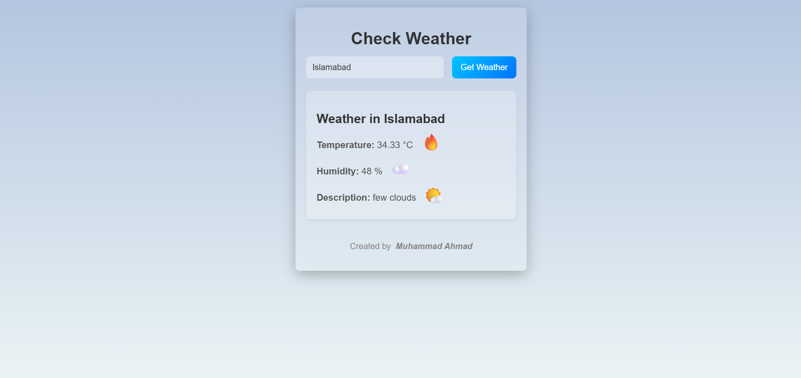

# ⛅ Angular Weather App

A sleek and responsive weather application built using **Angular 19**, **SCSS**, and a **service-driven architecture**. It uses the [OpenWeatherMap API](https://openweathermap.org/) to display live weather updates with fun and meaningful emoji indicators.

---

## 🌐 Live Demo

👉 [Click here to use the app](https://ahmad-889.github.io/weather/)

---

## 🎯 What I Built

This application is structured into modular standalone components with clean separation between UI and business logic. Here’s what I built:

* ✅ `WeatherComponent`: The core UI for searching weather by city or current location  
* ✅ `WeatherService`: Handles all API calls to fetch weather data  
* ✅ Emoji-based representation for **temperature**, **humidity**, and **weather conditions**  
* ✅ Graceful fallback to **geolocation** when no city is entered  

---

## 💡 Key Features

* Search weather by **city name** or **current location**
* Live temperature, humidity, and condition updates  
* Emoji representation for easy visual understanding:
  * ❄️ Cold
  * 🔥 Hot
  * ☁️ Clouds
  * 🌧️ Rain, etc.  
* **Glassmorphism** UI design with smooth animations  
* Mobile-responsive layout for all screen sizes  
* Loading indicator and error messages for better UX

---

## 🧱 Technologies Used

* Angular 19 (Standalone Components)
* TypeScript
* SCSS (Glassmorphism + Responsive Design)
* RxJS + Angular HTTPClient
* REST API integration (OpenWeatherMap)
* Reactive Forms

---

## 📸 Screenshot



---

## 📁 Project Structure


```
src/
└── app/
├── components/
│ └── weather/
│ ├── weather.component.ts   # Component logic
│ ├── weather.component.html # UI template
│ └── weather.component.scss # Styling (Glassmorphism)
└── services/
└── weather.service.ts       # API integration logic
```

---


## ⚙️ API Used

**[OpenWeatherMap API](https://openweathermap.org/)**  
Live weather data accessed via this endpoint:

---


## 🚀 Running the Project

Install Angular CLI if you haven't:

```bash
npm install -g @angular/cli
```

Install dependencies and serve:

```bash
npm install
ng serve
```

Visit `http://localhost:4200` to see the custom directives in action.

---

## 🔗 Author
Made with ❤️ by
Muhammad Ahmad
